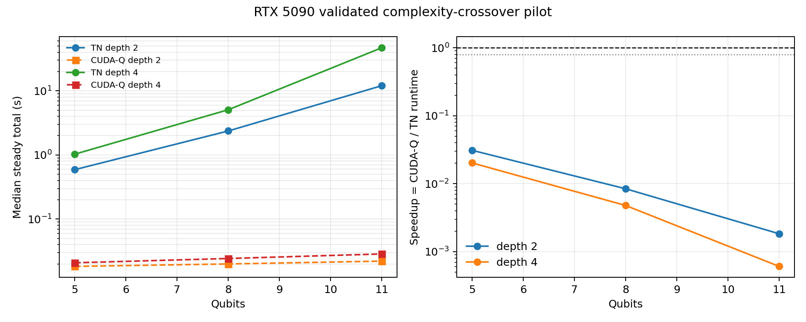

# RTX 5090 Complexity-Crossover Pilot

## Conclusion

**PASS for statistical validity; no performance crossover observed.** All six
measured points passed the exact-reference hard gate.  None approached or beat
CUDA-Q under the predeclared definition that "approaches" means a steady
CUDA-Q/TN runtime ratio of at least 0.8.  The closest point was the smallest
workload, 5 qubits at entangling depth 2, with a ratio of 0.03099 (TN was
32.27 times slower).  At the largest measured point, 11 qubits at depth 4, the
ratio was 0.0006084 (TN was 1,643.53 times slower).

This bounded pilot therefore provides no evidence of a real crossover on the
RTX 5090.  It does not establish that a crossover is impossible outside the
measured 5/8/11-qubit, depth-2/4 region, and no result is extrapolated beyond
those points.

## Frozen comparison

The pilot uses deterministic nearest-neighbor brickwork circuits.  Only qubit
count and entangling depth change.  Every point uses:

- 1,024 categorical trajectory draws from NumPy seed 5772;
- the identical 16 trajectory codes and multiplicities (identity 791; the 15
  nonidentity two-qubit Pauli codes retain their exact shared counts in the
  machine-readable record);
- one categorical two-qubit depolarizing site with `p = 0.22`, immediately
  after the first logical `CX(0, 1)`;
- 64 measurement shots per trajectory draw, for 65,536 effective shots;
- TN `complex128` and CUDA-Q `nvidia fp64`;
- upstream TN `max_free_qubits = 2`;
- five alternating steady-state repetitions in one fresh process per point;
- the pinned upstream commit
  `0569f848d9a3e385d6c20162c534a8031f6a69c5`.

The full circuit, noise site, trajectory multiplicities, raw repeats, timing
profiles, validation thresholds, software versions, and hardware properties
are stored in
[`results/performance/2026-09-10_complexity_crossover_pilot.json`](../results/performance/2026-09-10_complexity_crossover_pilot.json).

## Validation hard gate

For every workload, the trusted reference evaluates each of the 16 fixed Kraus
branches with an independent NumPy complex128 statevector and combines them
using the frozen trajectory multiplicities.  TN and CUDA-Q samples are each
compared with that exact conditioned distribution, and with each other, using
TVD and the `Z0 Z(n-1)` expectation error.  Limits are the seeded 0.999
quantiles of 1,000 stratified null experiments.  A timing point is valid only
if all three comparisons pass.

All six points passed.  The tightest TN TVD margin occurred at 11q/depth-4:
0.04828 observed versus a 0.05348 null limit.  The corresponding CUDA-Q result
was 0.04995 versus 0.05281, and TN versus CUDA-Q was 0.06953 versus 0.07536.
Their expectation errors also passed (TN 0.001501 versus 0.01456; CUDA-Q
0.0007570 versus 0.01285).  The increasing raw TVD at larger output spaces is
consistent with the seeded finite-shot null distribution; it is not evidence
of a semantic mismatch.

## Measured scaling

Speedup is defined throughout as CUDA-Q explicit steady total divided by TN
proportional steady total.  Values below one favor CUDA-Q.

| Qubits | Entangling depth | Coherent gates | TN steady (s) | CUDA-Q steady (s) | CUDA-Q/TN | TN slowdown | TN contractions |
|---:|---:|---:|---:|---:|---:|---:|---:|
| 5 | 2 | 24 | 0.59031 | 0.018293 | 0.03099 | 32.27x | 281 |
| 5 | 4 | 48 | 1.02884 | 0.020815 | 0.02023 | 49.43x | 336 |
| 8 | 2 | 39 | 2.36699 | 0.019958 | 0.008432 | 118.60x | 911 |
| 8 | 4 | 78 | 5.07341 | 0.024287 | 0.004787 | 208.89x | 1,315 |
| 11 | 2 | 54 | 12.02910 | 0.022107 | 0.001838 | 544.14x | 3,912 |
| 11 | 4 | 108 | 46.97504 | 0.028582 | 0.0006084 | 1,643.53x | 10,280 |

At depth 2, TN steady time increased 0.59031 -> 2.36699 -> 12.02910 s
as qubits increased 5 -> 8 -> 11.  CUDA-Q increased only 0.018293 ->
0.019958 -> 0.022107 s over those same measured points.  At depth 4, TN
increased 1.02884 -> 5.07341 -> 46.97504 s, while CUDA-Q increased 0.020815
-> 0.024287 -> 0.028582 s.  Increasing depth from 2 to 4 multiplied TN time
by 1.74x, 2.14x, and 3.91x at 5, 8, and 11 qubits, respectively.  The
corresponding measured CUDA-Q multipliers were 1.14x, 1.22x, and 1.29x.



## Timing decomposition

TN GPU contraction is the dominant measured steady component at every point,
rising from 86.5% of steady time at 5q/depth-2 to 98.0% at 11q/depth-4.  At
the largest point, median components were:

- GPU contractions: 46.0253 s;
- applying trajectory errors: 0.4450 s;
- host sampling: 0.3964 s;
- Q-Tensor post-processing: 0.000489 s.

The contraction count grew from 281 to 10,280 across the measured region.  In
this unmodified proportional sampler, that growth dominates the circuit-cost
increase; neither Python result assembly nor trajectory-error application is
the primary bottleneck.

Path/setup and cold measurements remain separate from the speedup ratio.  TN
median per-call load/conversion/operand setup grew from 0.0603 s to 0.2776 s;
TN cold first-use wall time grew from 1.841 s to 53.427 s.  CUDA-Q target,
kernel-build, and compile-warmup setup ranged from 0.386 s to 0.533 s.  No cold
speedup is reported because TN initialized the shared CUDA context before the
CUDA-Q setup measurement in each isolated worker.

CUDA-Q 0.13 exposes trajectory execution and device sampling together through
`cudaq.sample`, so its steady sample-call component cannot be split further.
Host post-processing is reported separately in the JSON.

An untimed 50 ms global-device telemetry run at 11q/depth-4 recorded TN median
GPU utilization of 47% (51% peak) and 5,065--5,224 MiB used.  CUDA-Q telemetry
recorded 29.5% median (48% peak) and 5,075--5,083 MiB, but only four samples
were captured because CUDA-Q completed quickly.  These coarse counters are
diagnostic and are not used in timing or speedup calculations.

## Reproduction

From the repository root in the pinned `q-tensor` environment:

```bash
PYTHONPATH="$PWD/src:$PWD/scripts" python scripts/run_complexity_crossover.py \
  --upstream /home/manager/q-tensor/upstream/Accelerated_TN_PTSBE \
  --output results/performance/2026-09-10_complexity_crossover_pilot.json \
  --qubits 5 8 11 --depths 2 4 \
  --trajectory-count 1024 --shots-per-trajectory 64 \
  --repeats 5 --null-trials 1000

PYTHONPATH="$PWD/src" python scripts/plot_complexity_crossover.py \
  results/performance/2026-09-10_complexity_crossover_pilot.json \
  reports/figures/complexity_crossover_pilot.png
```

The benchmark process exits nonzero if any statistical gate fails, and the
plotter refuses to render an invalid result record.
