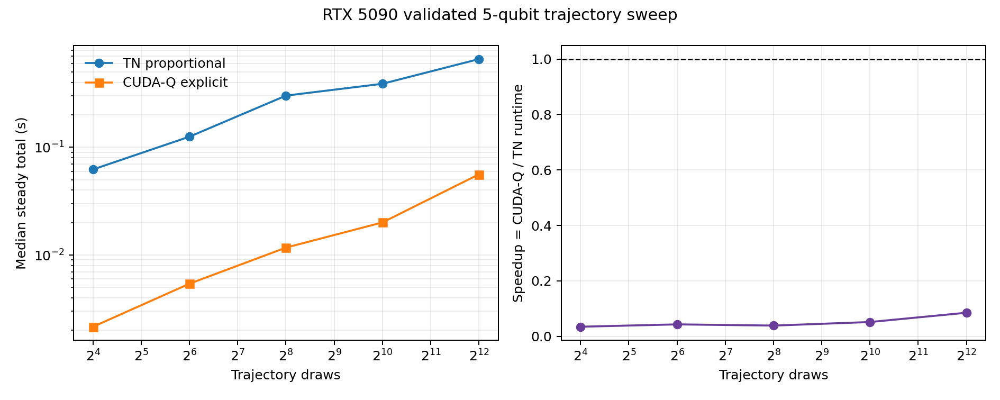

# Performance analysis

Date: 2026-09-10. Harness revision:
`969c46b64ce762f47633b691874e9c2e3058dd4a`. Pinned upstream revision:
`NVlabs/Accelerated_TN_PTSBE@0569f848d9a3e385d6c20162c534a8031f6a69c5`.

## Conclusion

The first scientifically fair RTX 5090 comparison is valid, but it does **not** show a
TN speedup on this five-qubit workload. No crossover occurred from 16 through 4,096
trajectory draws. At the largest point, explicit CUDA-Q took a median 0.056128 s and
TN proportional batching took 0.659389 s. With the declared definition

`speedup = CUDA-Q baseline steady runtime / TN steady runtime`, this is **0.08512x**.
Equivalently, TN was 11.75x slower. Effective throughputs were 4,670,460 shots/s for
CUDA-Q and 397,556 shots/s for TN.

This negative result is the first defensible local comparison; it is not evidence
against the upstream method at the larger tensor-network regimes it targets. The
five-qubit circuit is small enough for CUDA-Q's statevector baseline to be extremely
cheap, while TN performs tens to hundreds of separate conditional contractions.

No optimization was applied and no upstream speedup was reproduced or claimed.



## Fairness contract

The benchmark uses the frozen `5q_depolarizing2` validation case:

- circuit: seven coherent gates on five logical qubits, including two entanglers;
- noise: two-qubit categorical depolarization with p=0.22 after `CX(q0,q1)`;
- trajectory seed: 5772, with nested prefixes at 16, 64, 256, 1,024, and 4,096 draws;
- repeated trajectories grouped once with their exact multiplicity retained;
- 64 measurement shots per trajectory draw;
- TN: upstream proportional batched sampling, `max_free_qubits=2`, complex128;
- CUDA-Q: explicit kernel per unique trajectory, NVIDIA cuStateVec fp64 target;
- canonical output: `q0...q4` in both methods; and
- exact reference: independent complex128 Kraus-branch statevector mixture.

Thus each point changes trajectory count only. Total effective shots are trajectory
draws x 64, from 1,024 to 262,144. Both backends receive the same categorical
trajectory codes and the same `multiplicity x 64` shots per unique trajectory.

TN complex64 was attempted first but rejected before measurement: the unmodified
upstream sampler has complex128 projection constants and fails cuTensorNet's operand
type check on a complex64 network. CUDA-Q's supported fp64 target therefore provides
the precision-matched unmodified comparison.

## Hard statistical gate

Each timing point is accepted only if TN and CUDA-Q both agree with the exact
distribution conditioned on that finite trajectory prefix, and with each other. The
gate uses TVD and Z0Z1 expectation error against 1,000 seeded null replicates that
preserve the per-trajectory shot allocation. All 15 checks passed.

| Trajectories | TN TVD / limit | CUDA-Q TVD / limit | TN/CUDA-Q TVD / limit | Valid |
|---:|---:|---:|---:|---:|
| 16 | 0.043677 / 0.073035 | 0.018159 / 0.067312 | 0.055664 / 0.091797 | PASS |
| 64 | 0.014586 / 0.039974 | 0.018605 / 0.032905 | 0.021484 / 0.048828 | PASS |
| 256 | 0.008466 / 0.017075 | 0.011670 / 0.015839 | 0.016663 / 0.024597 | PASS |
| 1,024 | 0.003597 / 0.008506 | 0.003189 / 0.010524 | 0.004990 / 0.011887 | PASS |
| 4,096 | 0.002924 / 0.004471 | 0.001880 / 0.004161 | 0.003139 / 0.006626 | PASS |

The timing harness writes a result even on failure, marks invalid points, returns
nonzero, and the plotting script refuses to graph a result whose hard gate failed.

## Timing methodology

Each trajectory count runs in a fresh worker process so path and compiler caches do
not leak across sweep points. A worker records one TN first-use invocation separately,
initializes both backends, and then alternates TN/CUDA-Q order for five steady
repetitions. Reported steady values are medians; raw samples, min/max, and median
absolute deviation are retained in JSON.

The primary steady interval includes the work needed to produce and combine all
requested counts:

- TN steady total = upstream contraction/sampling loop + Q-Tensor count merge;
- CUDA-Q steady total = all `cudaq.sample` calls + Q-Tensor count merge.

CUDA-Q 0.13 does not expose device trajectory evolution and device sampling as
separate timers. The report therefore retains their combined `cudaq.sample` interval
instead of inventing a split. For TN, host `numpy.random.choice`, host post-processing,
CUDA-event contraction time, and error-application time are separately captured.

Cold/setup values are reported as components, not combined into a cold speedup. TN
creates the process CUDA context first, so CUDA-Q's later target/compile setup would
otherwise receive an unfair context-warm advantage.

## Steady-state result

| Trajectories | Unique | Effective shots | TN median (s) | CUDA-Q median (s) | Baseline/TN | TN shots/s | CUDA-Q shots/s |
|---:|---:|---:|---:|---:|---:|---:|---:|
| 16 | 3 | 1,024 | 0.062356 | 0.002160 | 0.03464x | 16,422 | 474,025 |
| 64 | 9 | 4,096 | 0.125636 | 0.005424 | 0.04317x | 32,602 | 755,157 |
| 256 | 16 | 16,384 | 0.302034 | 0.011722 | 0.03881x | 54,246 | 1,397,748 |
| 1,024 | 16 | 65,536 | 0.388994 | 0.020075 | 0.05161x | 168,476 | 3,264,518 |
| 4,096 | 16 | 262,144 | 0.659389 | 0.056128 | 0.08512x | 397,556 | 4,670,460 |

There is no measured crossover. The relative gap narrows at the largest points—from
TN being 28.87x slower at 16 trajectories to 11.75x slower at 4,096—but the trend is
not sufficient to extrapolate a crossover beyond the measured range.

Over the 256x trajectory increase, TN steady time increased 10.57x and CUDA-Q time
increased 25.98x. TN throughput therefore improved more sharply, which is consistent
with amortization, but its absolute overhead remained much larger. The categorical
noise support saturated at 16 unique trajectories by the 256-draw point. TN
contractions rose from 37 to 202 by that point and then plateaued at 208 for 1,024 and
4,096 draws.

## Setup and path planning

| Trajectories | TN setup/path median (s) | CUDA-Q target/build/compile (s) |
|---:|---:|---:|
| 16 | 0.044818 | 0.088436 |
| 64 | 0.053724 | 0.225618 |
| 256 | 0.050390 | 0.355391 |
| 1,024 | 0.049222 | 0.343079 |
| 4,096 | 0.042697 | 0.341051 |

TN setup combines QPY load, `CircuitToEinsum`, expression/network construction, and
path planning because the upstream function exposes those as one timed construction
region. It stayed near 43--54 ms after initialization. CUDA-Q setup grew with the
number of explicit kernels and stabilized near 0.34 s when all 16 noise alternatives
were present.

TN first-use wall times were 1.22--2.00 s across workers, much larger than warmed
medians because CUDA/cuTensorNet context and first-use costs are included. These are
retained in the raw result but not compared with CUDA-Q's context-warm setup.

## Dominant runtime component

At 4,096 trajectories:

- TN steady total: 0.659389 s;
- summed CUDA-event contraction time: 0.594723 s, about 90.2% of steady total;
- host sampling: 0.017075 s, about 2.6%;
- host count merge: 0.000032 s; and
- error application: 0.051308 s, about 7.8%.

The component timers have small measurement overlap and should not be added as an
exact accounting identity. They nevertheless identify GPU contractions as the clear
dominant cost. Path planning is a setup cost and host sampling is not the limiting
stage for this workload.

## GPU utilization and memory

An untimed telemetry repetition at 4,096 trajectories sampled global `nvidia-smi`
counters every 50 ms. TN showed 18% peak and 2% median GPU utilization across 17
samples; the repeated CUDA-Q telemetry workload showed 18% peak and 10% median across
8 samples. Global used memory remained around 5,469--5,474 MiB.

These are coarse device-wide observations, not process-isolated peak allocations. The
workloads are short relative to the polling interval, and both libraries are resident
in the worker, so the 3--5 MiB deltas do not estimate each backend's true peak VRAM.
They support only the limited conclusion that this small case does not sustain high
RTX 5090 utilization. No occupancy or memory-bandwidth claim is made.

## Crossover and next decision

**Measured crossover: none through 4,096 trajectories.** A broader trajectory-only
sweep is not justified yet: all 16 error alternatives and the 208-contraction TN work
structure have already saturated, while TN remains 11.75x slower at the largest point.

The harness and validation gate do justify one bounded next pilot that changes circuit
complexity rather than chasing more shots: increase qubit count/depth enough that
explicit statevector trajectory execution is material, retain a tractable exact
reference, and run a small `[64, 256, 1024]` trajectory sweep. Only if that pilot shows
a stable approach to or crossing of 1.0x should Q-Tensor launch a broader parameter
sweep or profiling campaign.

## Reproduce

```bash
conda activate q-tensor
PYTHONPATH=src python scripts/run_fair_benchmark.py \
  --upstream upstream/Accelerated_TN_PTSBE \
  --output results/performance/2026-09-10_fair_5q_trajectory_sweep.json \
  --trajectory-counts 16 64 256 1024 4096 \
  --shots-per-trajectory 64 \
  --repeats 5 \
  --null-trials 1000

PYTHONPATH=src python scripts/plot_performance.py \
  results/performance/2026-09-10_fair_5q_trajectory_sweep.json \
  reports/figures/performance_5q_trajectory_scaling.png
```

The complete raw repetitions, component timings, validation metrics and limits,
trajectory multiplicities, environment, hardware, commands, and telemetry are in
`results/performance/2026-09-10_fair_5q_trajectory_sweep.json`.
